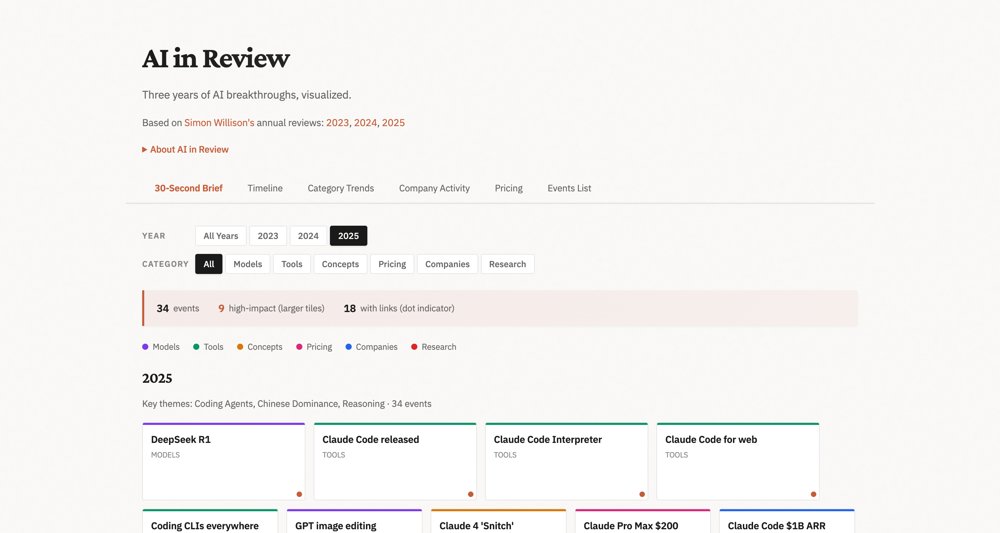

# AI in Review

**Three years of AI breakthroughs, visualized.**

**[View Live](https://ai-in-review.netlify.app)**

---

An interactive timeline visualization of major AI/LLM developments from 2023-2025, based on [Simon Willison's](https://simonwillison.net/) annual year-in-review blog posts:

| Year | Original Post |
|------|---------------|
| 2023 | [Stuff we figured out about AI in 2023](https://simonwillison.net/2023/Dec/31/ai-in-2023/) |
| 2024 | [Things we learned about LLMs in 2024](https://simonwillison.net/2024/Dec/31/llms-in-2024/) |
| 2025 | [2025: The Year in LLMs](https://simonwillison.net/2025/Dec/31/the-year-in-llms/) |

## Features

- **71 events** across 3 years with **55+ source links**
- **Multiple views**: 30-Second Brief, Timeline, Charts, Events List
- **Interactive filtering** by year and category
- **D3.js visualizations**: swimlane timeline, category trends, company activity, pricing history
- **Mobile responsive** dark theme

## Categories

| Category | Description |
|----------|-------------|
| Models | GPT-4, Claude, Llama, Gemini, Mistral, etc. |
| Tools | CLI tools, APIs, frameworks |
| Concepts | New terminology and paradigms |
| Companies | Corporate announcements and milestones |
| Research | Papers, benchmarks, competitions |
| Pricing | Cost changes and subscription tiers |

## Attribution

All content derives from [Simon Willison's](https://simonwillison.net/) blog. This visualization is a derivative work intended to make his annual reviews more navigable.

**Support Simon's work:**
- [simonwillison.net](https://simonwillison.net/)
- [@simonw on GitHub](https://github.com/simonw)
- [Sponsor Simon](https://github.com/sponsors/simonw)

## License

[MIT](LICENSE) for the visualization code. Content is derived from Simon Willison's blog posts.
